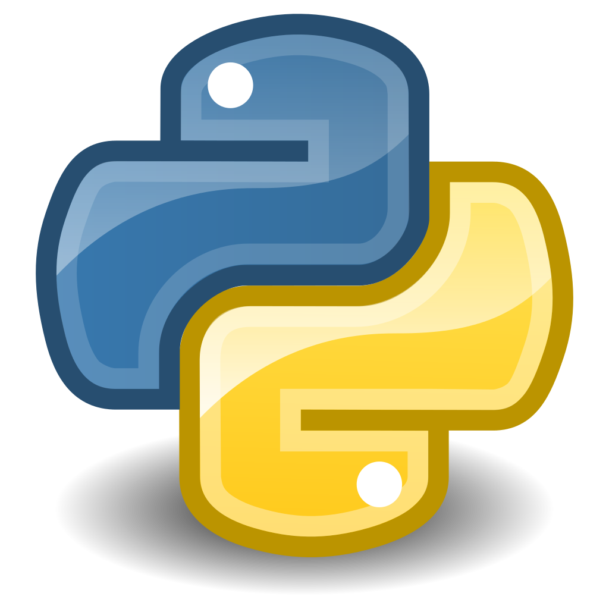

<!--Headings-->
# My tittle

## Mi tittle h2

### Mi tittle h3

#### Mi tittle h4

##### Mi title h5

<!--italic-->
this is an *italic* text
<!--strong-->
this is an **strong** text
<!--texto tachado-->
this is an ~~texto~~ tachado

<!--Order list-->
## Order list
1. apple
    1. apple 2
2. Orange
3. Any idea
## Unorder list
* Shoe
    * Shoe little
* Other shoe
* And more things about the shoes
<!--Links-->
[Welcome to my github](https://github.com/luisjacobpy/hyperblog "Welcome to y portafolio")

<!--Quote-->
> this is a quote

<!--Divisor line-->
### This is a divisor line
---
<!--This is the second way-->
___

<!--write code-->
`console.log('hello world')`

```python
class Persona:
    def __init__(self, nombre, apellido, edad):
        self._nombre = nombre
        self._apellido = apellido
        self._edad = edad

    def mostrar_detalle(self):
        print(f'Persona: {self._nombre}, {self._apellido},') #La variable self solo dse encuentra dentro de la definicion de la clase.
#Destructor
    def __del__(self):
        print(f'Persona:{self._nombre} {self._apellido}')

#Si se ejecuta dese otro archivo no se ejecuta el codigo.
if __name__ == "__main__":
    persona1 = Persona('Juan', 'Perez', 28)
#Si al imprimir aparece main, significa que estamos mandando a imprimir desde este mismo archivo
    print(__name__)
```

```html
<h1>hello world this is a tittle</h1>
```
<!--Table-->
| Table      | Are           | Cool    |
|------------|:-------------:|:--------:|
| col 3 is   | righ-aligned  | $1600    |
| col 2 is   | righ-aligned  | $12    |

<!--image-->
<!--From link-->


<!--from pc--->



<!--GitHub MarkDown-->
* [x] Task 1
* [] Task 2
* [] Task 3